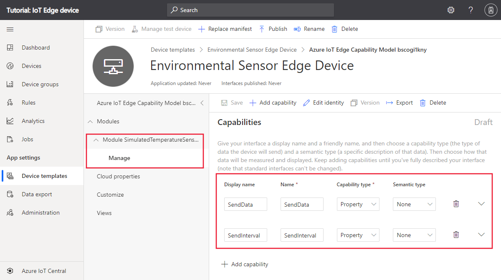
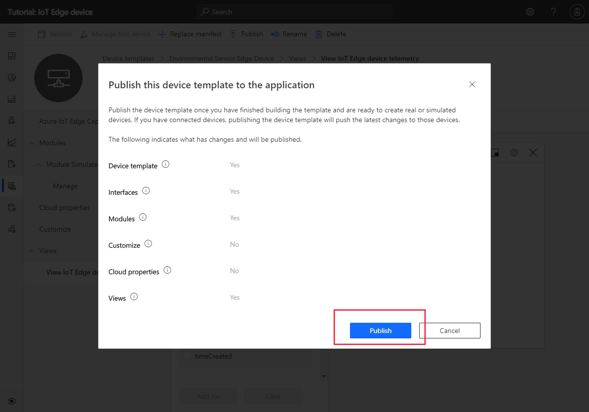
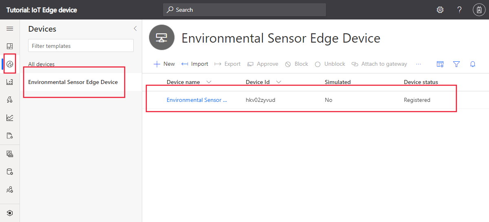
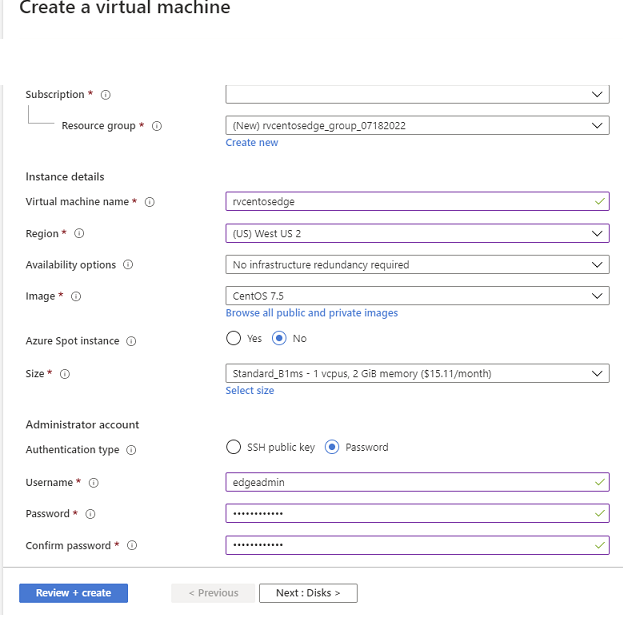
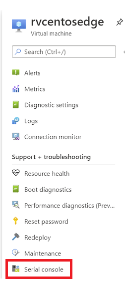
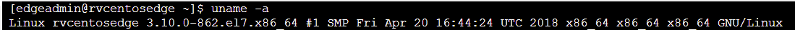
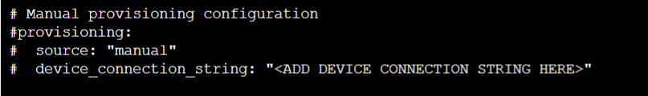
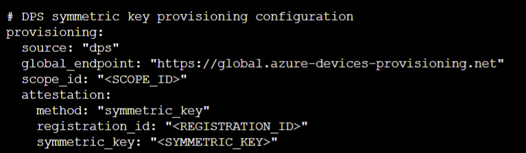

## Azure IoT Edge on CentOS Connnected to IoT Central

   

This tutorial demonstrates a scenario of IoT Edge runtime running on CentOS 7.X and provisioned and managed from IoT Central. It requires a device or VM running CentOS 7.X and an IoT Central App to provision and manage it. This tutorial will use an CentOS 7.5 deployed on Azure.

[IoT Edge Support](https://docs.microsoft.com/en-us/azure/iot-edge/support) lists Azure IoT Edge supported systems. 


In this tutorial, you learn how to:

> * Create a device template for an IoT Edge device
> * Create an IoT Edge device in IoT Central
> * Deploy a simulated IoT Edge device to a CentOS VM

## Prerequisites

Complete the [Create an Azure IoT Central application](https://docs.microsoft.com/en-us/azure/iot-central/core/quick-deploy-iot-central) quickstart to create an IoT Central application using the **Custom app > Custom application** template.

To complete the steps in this tutorial, you need an active Azure subscription.

If you don't have an Azure subscription, create a [free account](https://azure.microsoft.com/free/?WT.mc_id=A261C142F) before you begin.

Download the IoT Edge manifest file from GitHub. Right-click on the following link and then select **Save link as**: [EnvironmentalSensorManifest.json](https://raw.githubusercontent.com/Azure-Samples/iot-central-docs-samples/master/iotedge/EnvironmentalSensorManifest.json)

## Create device template

In this section, you create an IoT Central device template for an IoT Edge device. You import an IoT Edge manifest to get started, and then modify the template to add telemetry definitions and views:

### Import manifest to create template

To create a device template from an IoT Edge manifest:

1. In your IoT Central application, navigate to **Device templates** and select **+ New**.

1. On the **Select template type** page, select the **Azure IoT Edge** tile. Then select **Next: Customize**.

1. On the **Upload an Azure IoT Edge deployment manifest** page, enter *Environmental Sensor Edge Device* as the device template name. Then select **Browse** to upload the **EnvironmentalSensorManifest.json** you downloaded previously. Then select **Next: Review**.

1. On the **Review** page, select **Create**.

1. Select the **Manage** interface in the **SimulatedTemperatureSensor** module to view the two properties defined in the manifest:



### Add telemetry to manifest

An IoT Edge manifest doesn't define the telemetry a module sends. You add the telemetry definitions to the device template in IoT Central. The **SimulatedTemperatureSensor** module sends telemetry messages that look like the following JSON:

```json
{
  "machine": {
    "temperature": 75.0,
    "pressure": 40.2
  },
  "ambient": {
    "temperature": 23.0,
    "humidity": 30.0
  },
  "timeCreated": ""
}
```

To add the telemetry definitions to the device template:

1. Select the **Manage** interface in the **Environmental Sensor Edge Device** template.

1. Select **+ Add capability**. Enter *machine* as the **Display name** and make sure that the **Capability type** is **Telemetry**.

1. Select **Object** as the schema type, and then select **Define**. On the object definition page, add *temperature* and *pressure* as attributes of type **Double** and then select **Apply**.

1. Select **+ Add capability**. Enter *ambient* as the **Display name** and make sure that the **Capability type** is **Telemetry**.

1. Select **Object** as the schema type, and then select **Define**. On the object definition page, add *temperature* and *humidity* as attributes of type **Double** and then select **Apply**.

1. Select **+ Add capability**. Enter *timeCreated* as the **Display name** and make sure that the **Capability type** is **Telemetry**.

1. Select **DateTime** as the schema type.

1. Select **Save** to update the template.

The **Manage** interface now includes the **machine**, **ambient**, and **timeCreated** telemetry types:


### Add views to template

The device template doesn't yet have a view that lets an operator see the telemetry from the IoT Edge device. To add a view to the device template:

1. Select **Views** in the **Environmental Sensor Edge Device** template.

1. On the **Select to add a new view** page, select the **Visualizing the device** tile.

1. Change the view name to *View IoT Edge device telemetry*.

1. Select the **ambient** and **machine** telemetry types. Then select **Add tile**.

1. Select **Save** to save the **View IoT Edge device telemetry** view.


### Publish the template

Before you can add a device that uses the **Environmental Sensor Edge Device** template, you must publish the template.

Navigate to the **Environmental Sensor Edge Device** template and select **Publish**. On the **Publish this device template to the application** panel, select **Publish** to publish the template:



## Add IoT Edge device

Now you've published the **Environmental Sensor Edge Device** template, you can add a device to your IoT Central application:

1. In your IoT Central application, navigate to the **Devices** page and select **Environmental Sensor Edge Device** in the list of available templates.

1. Select **+ New** to add a new device from the template. On the **Create new device** page, select **Create**.

You now have a new device with the status **Registered**:



### Get the device credentials

When you deploy the IoT Edge device later in this tutorial, you need the credentials that allow the device to connect to your IoT Central application. The get the device credentials:

1. On the **Device** page, select the device you created.

1. Select **Connect**.

1. On the **Device connection** page, make a note of the **ID Scope**, the **Device ID**, and the **Primary Key**. You use these values later.

1. Select **Close**.

You've now finished configuring your IoT Central application to enable an IoT Edge device to connect.

## Deploy an IoT Edge device on CentOS

In this tutorial, you use a CentOS VM, created on Azure to simulate an IoT Edge device. 

Below are the steps to install a CentOS VM and install IoT Edge runtime. 

1. Go To [Azure Portal](https://portal.azure.com)

1. You can search for CentOS 7.5 VM from marketplace and click **Create** button to install CentOS 7.5 VM  

1. Enter valid information and click **Review + create**  

    

1. Go To newly created CentOS VM and click on **serial console**  and enter your login and password.



2. Check the OS and Version on the VM, type
    ```bash
    $ uname -a
    ```    



3. Install Moby engine. As of the date this tutorial was created following is the latest package. To get the latest package go to [Moby Engine Packages](https://packages.microsoft.com/centos/7/prod/)

    ```bash
   $ sudo yum install https://packages.microsoft.com/centos/7/prod/moby-engine-3.0.13%2Bazure-0.x86_64.rpm
    ```    

    Install CLI
    ```bash
   $ sudo yum install https://packages.microsoft.com/centos/7/prod/moby-cli-3.0.13%2Bazure-0.x86_64.rpm
    ```    

4. Install dependencies
    ```bash
   $ sudo yum install http://ftp.altlinux.org/pub/distributions/ALTLinux/Sisyphus/x86_64/RPMS.classic/libcrypto10-1.0.2r-alt3.x86_64.rpm
    ```    
5. Install IoT Edge Runtime
    ```bash
   $ sudo yum install https://github.com/Azure/azure-iotedge/releases/download/1.0.9.3/libiothsm-std_1.0.9.3-1.el7.x86_64.rpm

   $ sudo rpm -Uhv https://github.com/Azure/azure-iotedge/releases/download/1.0.9.3/iotedge-1.0.9.3-1.el7.x86_64.rpm
    ``` 

    

6. Edit /etc/iotedge/config.yaml to update Device provisioning service properties to provision the device

    Comment out manual configuration portion on the config.yaml

    

    Uncomment out device provisioning service with symmetric key and update **scope id**, **registration id** with your device id from IoT Central and **symmetric key** which you got from the **Get the device credentials** section of this tutorial
    
    
 
6. Restart Edge and list edge modules
    ```bash
   $ sudo systemctl restart iotedge

   $ sudo iotedge list 
    ```    

6. Go To Device Details page on IoT Central and you will see telemetry flowing from your device
    
    
